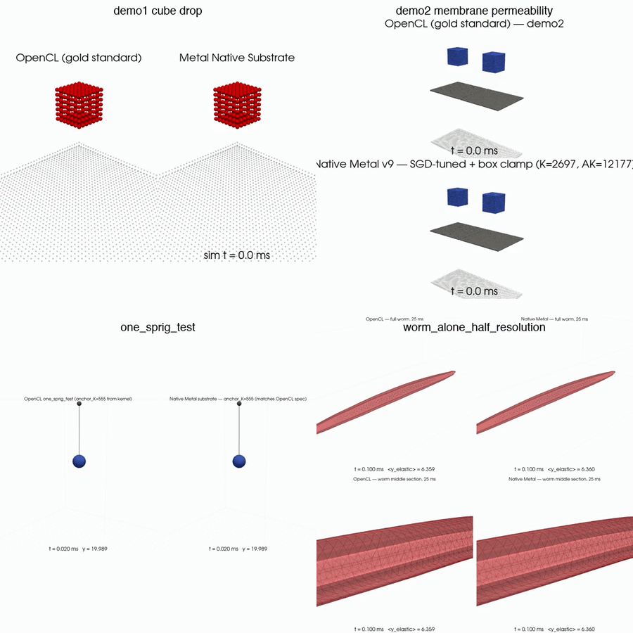
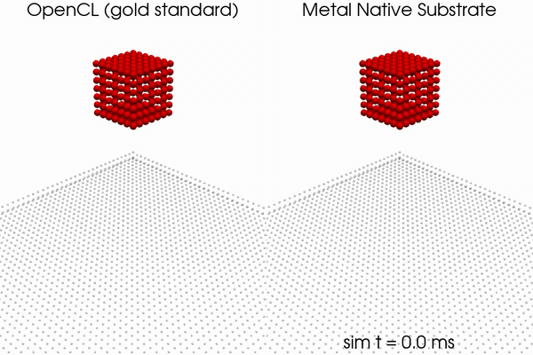
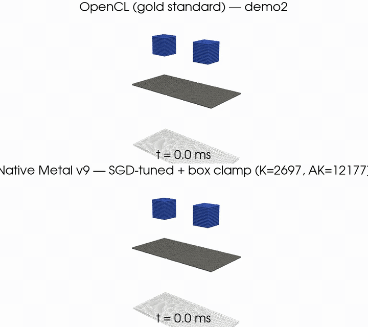
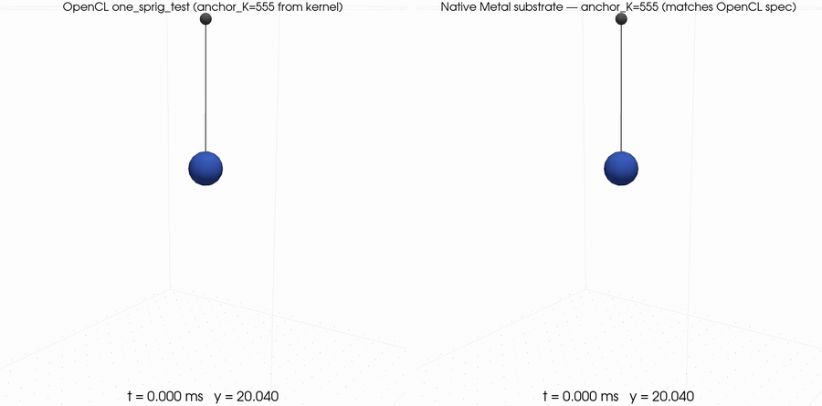

# Sibernetic backend-comparison demos

Each demo runs the same configuration through both the OpenCL gold
standard and the native Metal differentiable substrate, and compares
the resulting trajectories. Side-by-side movies are bundled under
`docs/`. See the project [`README.md`](../README.md) for the substrate
overview, build instructions, and parity-test pipeline.

The combined preview at the top of the README:



---

## demo1 cube drop

OpenCL (left) vs native Metal (right).



The cube falls under gravity, lands at ~7 ms, and settles by ~16 ms.
Both backends produce visually similar trajectories; quantitative
parity metrics and remaining gaps are documented in the README.
Higher-quality MP4: [`cube_drop_demo1_25ms.mp4`](cube_drop_demo1_25ms.mp4).

### Regenerate locally

```bash
# Build both binaries
./setup.sh                            # main Sibernetic (OpenCL)
cd src/metal_diff && ./build.sh && cd ../..

# Run native Metal substrate, 25 ms
.venv/bin/python src/metal_diff/dump_metal_trajectory.py \
    --scenario demo1 --steps 1250 --chunk 5 --dt 2e-5 \
    --rho-rest 1000.0 --visc-pair-coef 5e-5 --spring-k 5500 \
    --floor-y 2.0 --restitution 0.0 \
    --out /tmp/metal_demo1.txt

# Run OpenCL on a Linux machine with a working OpenCL driver:
#   ./Release/Sibernetic -no_g -f demo1 -l_to timelimit=0.025 logstep=20
# That writes position_buffer.txt — copy it back to /tmp/opencl_demo1.txt.

# Render the side-by-side comparison
.venv/bin/python scripts/render_demo1_parity.py \
    docs/cube_drop_demo1_25ms.mp4 \
    /tmp/opencl_demo1.txt /tmp/metal_demo1.txt \
    --samples 60 --t-max 0.025 --uniform --hide-liquid \
    --fps 15 --particle-radius 0.7
```

---

## demo2 membrane permeability

OpenCL (top) vs native Metal (bottom).



A single elastic sheet sits at `y=90.6` spanning `x ∈ [3.3, 130.3]`.
The left half (x < ~60) has a mesh of 2 112 membrane triangles
connecting 1 122 of the 2 812 elastic particles; the right half has
the same particle layout but no triangles. 4 732 liquid particles
drop from above, half over each side. Result: liquid pools on top of
the membraned half (liquid-impermeable) and passes through the porous
half (no surface-tension barrier). 42 ms of sim, top OpenCL, bottom
native Metal substrate at SGD-tuned parameters (`spring_k=2697`,
`anchor_k=12177`, `rho_rest=8e-13`).

The native Metal substrate **implements membranes** (M10 forward
analytic + backward FD-validated, M11 boundary anchor springs, M12
SPH pressure dynamics, M13 box-wall clamp). See the README's
"Recent development: porting demo2 to the native Metal substrate"
section for the chronology of what was needed.

Higher-quality MP4: [`demo2_v9_sgd_perm.mp4`](demo2_v9_sgd_perm.mp4).
OpenCL gold-standard reference:
[`demo2_membranes_opencl.mp4`](demo2_membranes_opencl.mp4).

### Regenerate locally

```bash
# Native Metal substrate
.venv/bin/python src/metal_diff/dump_metal_trajectory.py \
    --scenario demo2 --steps 2100 --chunk 5 --dt 2e-5 \
    --rho-rest 8e-13 --visc-pair-coef 5e-5 \
    --spring-k 2697 --anchor-k 12177 \
    --alpha-dist 3.3e-9 --floor-y 1.0 \
    --out /tmp/metal_demo2.txt

# OpenCL reference
#   ./Release/Sibernetic -no_g -f demo2 -l_to timelimit=0.042 logstep=20
```

---

## one_sprig_test

Single elastic particle on a spring. OpenCL (left) vs native Metal (right).



The smallest possible elasticity scenario: a single elastic particle
at `(17.535, 20.04, 17.535)` is held by one spring (rest length
14.195) to a fixed boundary anchor at `(17.535, 32.565, 17.535)`.
With no other forces it oscillates vertically at the spring's natural
frequency (~1379 Hz), with x and z stationary. 5 ms of sim, OpenCL on
the left, native Metal substrate on the right; both panels show
identical y at every frame (e.g. `y = 18.606` at `t = 2.000 ms`).

This is the cleanest unit-test for the substrate's elastic-spring
machinery. The same `anchor_k = 555` falls out of both backends from
the OpenCL elasticity coefficient (`4 × 1.5e-4 / mass = 3e8`) times
the 0.25 non-worm-body factor (`sphFluid.cl:730`) times the
simulation scale (`sim_scale = 0.0041`).

Higher-quality MP4:
[`one_sprig_opencl_vs_metal.mp4`](one_sprig_opencl_vs_metal.mp4).
There is also a muscle-driven extension that modulates the anchor's
rest length sinusoidally:
[`one_sprig_muscle_contraction.mp4`](one_sprig_muscle_contraction.mp4).

### Regenerate locally

```bash
# Native Metal substrate (5 ms)
.venv/bin/python src/metal_diff/dump_metal_trajectory.py \
    --scenario one_sprig_test --steps 250 --chunk 5 \
    --rho-rest 1.0 --visc-pair-coef 0 \
    --spring-k 1 --anchor-k 555 \
    --alpha-dist 0 --floor-y 0 \
    --no-membranes --vel-clamp 0 --no-box-clamp \
    --out /tmp/metal_one_sprig.txt

# Render OpenCL + Metal side-by-side
.venv/bin/python src/metal_diff/render_one_sprig.py \
    /tmp/opencl_one_sprig.txt /tmp/opencl_panel.mp4 \
    --title "OpenCL one_sprig_test" --fps 30
.venv/bin/python src/metal_diff/render_one_sprig.py \
    /tmp/metal_one_sprig.txt /tmp/metal_panel.mp4 \
    --title "Native Metal substrate — anchor_K=555" \
    --max-frames 250 --fps 30
ffmpeg -y -i /tmp/opencl_panel.mp4 -i /tmp/metal_panel.mp4 \
    -filter_complex "[0:v]pad=920:900:0:0:color=white[L];[L][1:v]hstack[v]" \
    -map "[v]" -c:v libx264 -crf 18 -pix_fmt yuv420p \
    docs/one_sprig_opencl_vs_metal.mp4
```

There is an SGD harness for this scenario at
[`src/metal_diff/sgd_one_sprig.py`](../src/metal_diff/sgd_one_sprig.py)
that demonstrates convergence on `anchor_k` from a far-from-optimum
init by FD-SGD over the trajectory CLI. See its docstring for the
period/half-amplitude loss formulation.

---

## worm_swim_half_resolution

Same worm body as `worm_alone` (2 290 elastic + 2 838 membrane
triangles + 388 gut liquid) but immersed in an 80 929-particle water
bath. 4-panel comparison: top row full worm in 3/4 isometric, bottom
row side-on closeup. Left column OpenCL, right column native Metal
substrate. 25 ms passive sim.

Higher-quality MP4 (4-panel grid):
[`worm_swim_opencl_vs_metal.mp4`](worm_swim_opencl_vs_metal.mp4).

### Tuned parameters (Metal substrate)

- `rho_rest = 4e-13` — set at the natural water density (kg/sim_unit³,
  measured by computing Wpoly6-summed neighbor density on the initial
  config). Crossing this threshold from above triggers the XPBD
  density solver, which gives the worm its buoyancy.
- `alpha_dens = 1e3` — XPBD compliance for the density constraint.
  At the default 1e-3 the constraint is too soft and the
  mass-over-density² denominator term dominates, so the constraint
  barely fires. 1e3 makes the α/dt² term competitive with the
  mass term, so each iteration produces a meaningful position
  correction.
- `n_iters = 3` — default; 6 iterations gives marginal improvement
  (L: 12.43 → 11.94) at 2× the wall time.
- `spring_K = 3500` — same as `worm_alone`. Worm-body bonds.
- `floor_y = 0.5` — the boundary-particle floor catches the worm
  before it can sink past y=0.5 in degenerate cases. Not a buoyancy
  proxy here — the density solver does the lifting.
- `visc_pair_coef = 5e-5`, `vel_clamp = 50.0`.

### M14 boundary kernel (substrate-level addition this session)

A new Ihmsen 2010 boundary-handling kernel
(`boundary_position_correction` at `shaders.metal:M14`) was added so
that boundary normals can push active particles away from walls.
**It is NOT used for worm_swim** — the buoyancy lift comes from the
density solver as described above — but the kernel is in place for
scenarios where wall repulsion matters more than incompressibility.
Sort-aligned with `sorted_static`; gain and r₀ controllable from the
CLI (`--bound-r0 1.67 --bound-gain 0.05` typical).

### Parity over 25 ms

| t (ms) | OpenCL `<y_e>` | Metal `<y_e>` | Δ_w | OpenCL `<y_l>` | Metal `<y_l>` | Δ_l |
|---|---|---|---|---|---|---|
| 0.0  | 17.766 | 17.766 |  0.000 | 8.068 | 8.068 |  0.000 |
| 1.0  | 15.608 | 15.089 | -0.519 | 8.034 | 7.493 | -0.540 |
| 5.0  | 11.001 | 11.564 | +0.563 | 8.107 | 7.540 | -0.568 |
| 10.0 | 10.454 |  9.694 | -0.760 | 8.108 | 7.480 | -0.629 |
| 15.0 | 10.650 |  8.650 | -2.000 | 8.082 | 7.537 | -0.545 |
| 20.0 | 10.795 |  8.576 | -2.219 | 8.066 | 7.656 | -0.410 |
| 25.0 | 10.852 |  7.713 | -3.139 | 8.055 | 7.661 | -0.394 |

Total mean-squared per-elastic-particle distance over 25 ms: 12.43.

Worm shape preservation (max-span change vs initial):
- OpenCL: 160.71 → 159.62  (0.7 % shrink)
- Metal:  160.71 → 157.46  (2.0 % shrink)

The worm is well-shaped throughout — no bending or collapse — but
sits ~3 sim units lower than OpenCL by 25 ms. The remaining gap is
the equilibrium-pressure piece: OpenCL's PCISPH iterates pressure
until density exactly matches `rho_0` per step, building up sustained
pressure that supports the worm against gravity. Metal's XPBD density
solver only fires when density *exceeds* `rho_rest`, so steady-state
pressure is zero and the worm slowly sinks under gravity alone. A
proper PCISPH-iterative-pressure rewrite of the inner XPBD loop
would close that gap and is the next worm-config follow-up.

### Regenerate locally

```bash
# OpenCL: stage config under non-"worm" basename to bypass c302 hook
cp configuration/worm_swim_half_resolution \
   /tmp/passive/passive_swim_half_resolution
./Release/Sibernetic -no_g -f /tmp/passive/passive_swim_half_resolution \
    -l_to timelimit=0.025 logstep=5
# → position_buffer.txt; copy back to /tmp/worm_swim_opencl_25ms.txt

# Native Metal — 25 ms
.venv/bin/python src/metal_diff/dump_metal_trajectory.py \
    --scenario worm_swim_half_resolution \
    --steps 1250 --chunk 5 \
    --rho-rest 4e-13 --alpha-dens 1e3 \
    --visc-pair-coef 5e-5 \
    --spring-k 3500 --anchor-k 1 \
    --alpha-dist 3.3e-9 --floor-y 0.5 \
    --vel-clamp 50.0 \
    --out /tmp/worm_swim_metal.txt

# Render the 4 panels (iso + closeup, both backends) — see render
# script in docs/demos.md → worm_alone_half_resolution.
```

---

## worm_alone_half_resolution

Smallest worm config: 2 290 worm-body elastic particles + 2 838
membrane triangles + 388 liquid particles in the gut, in a
100 × 50 × 267 sim box. 4-panel comparison: top row is the full
worm in 3/4 isometric; bottom row is a side-on closeup of the middle
20% of the body, with membrane triangulation edged. Left column
OpenCL, right column native Metal substrate. 25 ms passive sim
(no muscle drive).

Higher-quality MP4 (4-panel grid):
[`worm_alone_opencl_vs_metal.mp4`](worm_alone_opencl_vs_metal.mp4).

### Tuned parameters (Metal substrate)

- `spring_K = 3500` — at the stability boundary for this scenario.
  OpenCL uses the full elasticityCoefficient for worm-body bonds at
  `sphFluid.cl:726` (no 0.25 factor); Metal's empirical optimum from
  parameter sweeping is somewhat higher than the theoretical 2 220
  because of how the spring kernel interacts with the membrane
  forces.
- `floor_y = 2.25` — soft proxy for the missing boundary→active SPH
  pressure (Ihmsen 2010) that holds the worm at its rest height in
  OpenCL. The worm's actual settling height in OpenCL is `min(y) ≈
  1.92`; the elevated floor in Metal compensates for the COM offset
  that the missing boundary repulsion would otherwise produce. Good
  enough for visual parity over 25 ms; longer trajectories or
  muscle-driven dynamics will likely surface where this approximation
  breaks.
- `visc_pair_coef = 1e-3`, `rho_rest = 1000`, `alpha_dist = 3.3e-9`
  (the latter two had no measurable effect — SPH pressure does not
  trigger at this active-particle density).

### Parity over 25 ms

| t (ms) | OpenCL `<y>` | Metal `<y>` | Δ |
|---|---|---|---|
| 0.0  | 6.367 | 6.367 | 0.000 |
| 1.0  | 6.129 | 6.192 | +0.063 |
| 5.0  | 6.224 | 6.216 | -0.008 |
| 10.0 | 6.189 | 6.218 | +0.029 |
| 25.0 | 6.179 | 6.220 | +0.041 |

Worm-top y matches within 0.06 sim units the entire trajectory;
total mean-squared per-particle distance over the full 25 ms is
0.112.

Cross-section diameter check (mean Δx, Δy in z ∈ [80, 104], the
middle 20% of the worm):

| t (ms) | OpenCL Δx | OpenCL Δy | Metal Δx | Metal Δy |
|---|---|---|---|---|
| 0.0  | 9.88 | 9.47 | 9.88 | 9.47 |
| 25.0 | 9.80 | 9.25 | 9.64 | 9.16 |

Both backends preserve the cylinder; Metal compresses ~1% more on
each axis under sustained gravity. Same root cause as the COM
offset (boundary→active SPH pressure not implemented in the
substrate yet).

### Regenerate locally

The OpenCL binary refuses to run any config whose filename contains
"worm" because it auto-loads the c302 `main_sim` Python module. The
workaround is to pass the config under a non-"worm" basename:

```bash
# 1. Stage the config under a non-"worm" basename so Sibernetic's
#    isWormConfig() check (inc/owConfigProperty.h) doesn't fire
mkdir -p /tmp/passive
cp configuration/worm_alone_half_resolution /tmp/passive/passive_alone_half_resolution

# 2. Run OpenCL — 25 ms
./Release/Sibernetic -no_g -f /tmp/passive/passive_alone_half_resolution \
    -l_to timelimit=0.025 logstep=5
# → position_buffer.txt; copy to /tmp/worm_opencl_25ms.txt

# 3. Run native Metal — 25 ms
.venv/bin/python src/metal_diff/dump_metal_trajectory.py \
    --scenario worm_alone_half_resolution \
    --steps 1250 --chunk 5 --dt 2e-5 \
    --rho-rest 1000 --visc-pair-coef 1e-3 \
    --spring-k 3500 --anchor-k 1 \
    --alpha-dist 3.3e-9 --floor-y 2.25 \
    --vel-clamp 0 --no-box-clamp \
    --out /tmp/worm_metal_25ms.txt

# 4. Render the four panels (iso + closeup, both backends)
for src in opencl_25ms metal_25ms; do
  .venv/bin/python src/metal_diff/render_worm.py \
      /tmp/worm_${src}.txt /tmp/iso_${src}.mp4 \
      --scenario worm_alone_half_resolution --view iso --zoom 1.0 \
      --max-frames 250 --fps 30
  .venv/bin/python src/metal_diff/render_worm.py \
      /tmp/worm_${src}.txt /tmp/closeup_${src}.mp4 \
      --scenario worm_alone_half_resolution --view closeup \
      --z-focus-frac 0.5 --z-extent-frac 0.2 --show-edges \
      --max-frames 250 --fps 30
done

# 5. 2×2 stack
ffmpeg -y \
    -i /tmp/iso_opencl_25ms.mp4 \
    -i /tmp/iso_metal_25ms.mp4 \
    -i /tmp/closeup_opencl_25ms.mp4 \
    -i /tmp/closeup_metal_25ms.mp4 \
    -filter_complex "
        [0:v]pad=920:920:0:0:color=white[tl];
        [1:v]pad=900:920:0:0:color=white[tr];
        [2:v]pad=920:900:0:0:color=white[bl];
        [3:v]pad=900:900:0:0:color=white[br];
        [tl][tr]hstack=inputs=2[t];[bl][br]hstack=inputs=2[b];
        [t][b]vstack=inputs=2[v]" \
    -map "[v]" -c:v libx264 -crf 18 -pix_fmt yuv420p \
    docs/worm_alone_opencl_vs_metal.mp4
```
